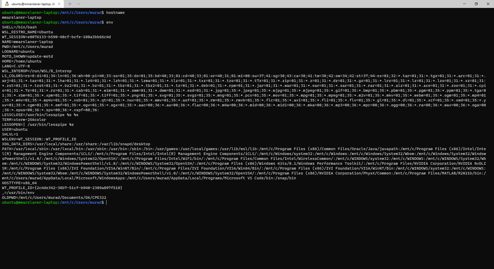
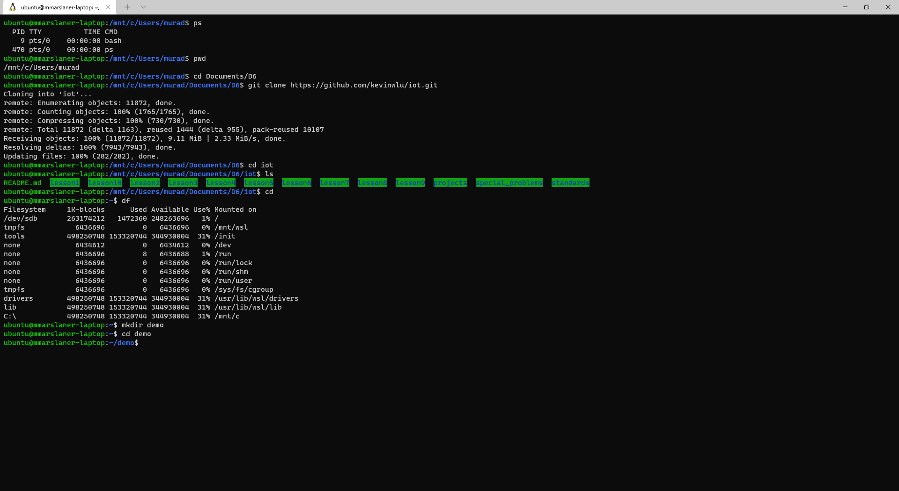
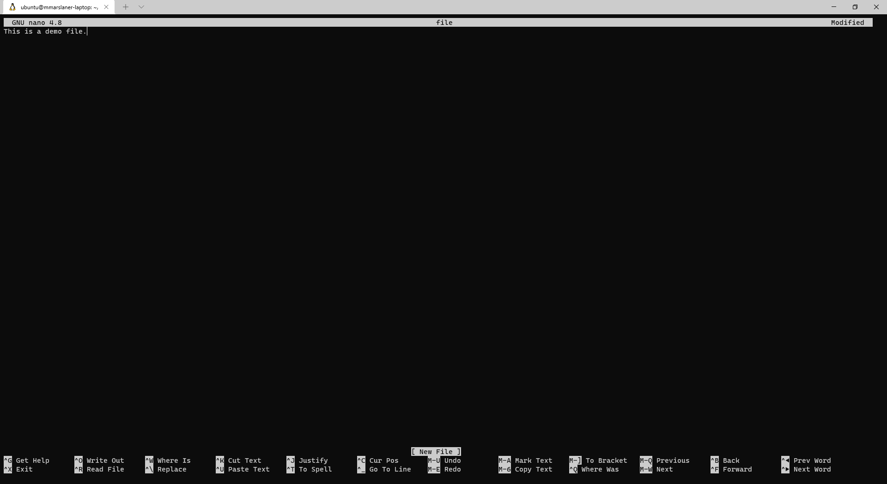
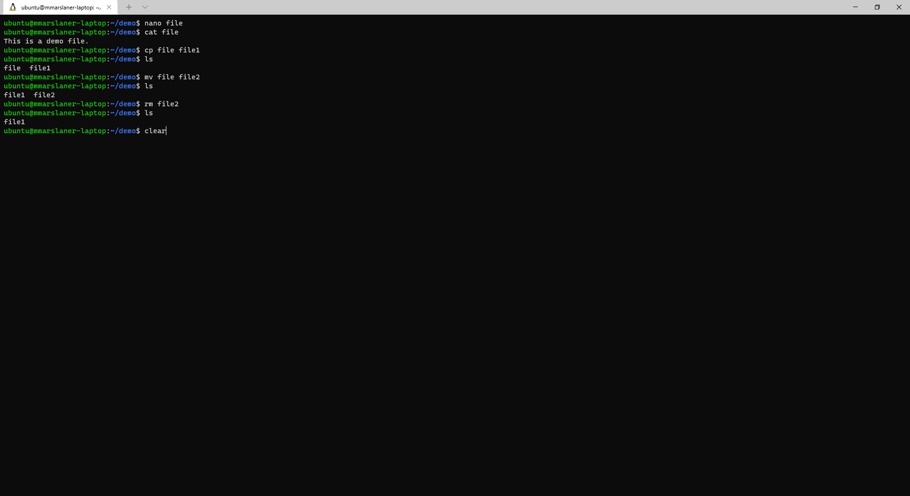
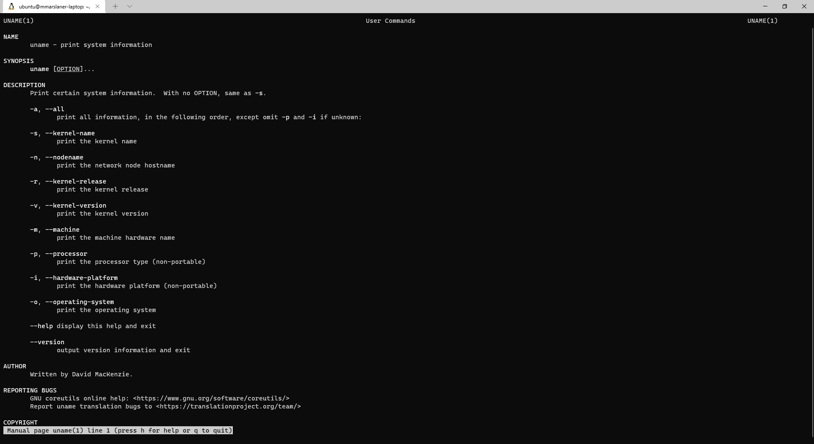
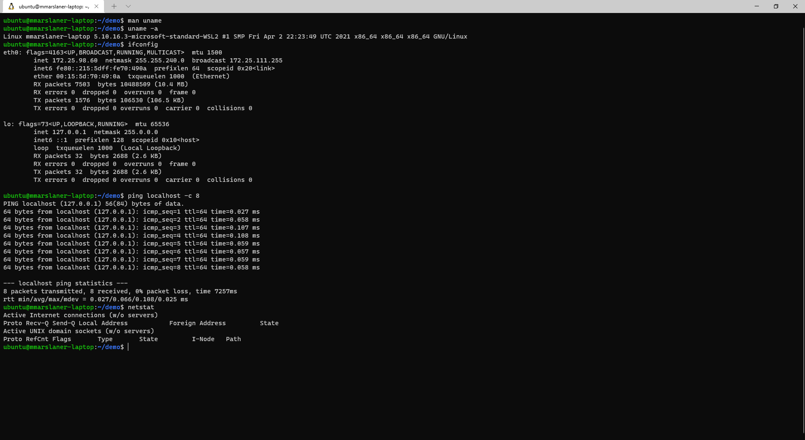
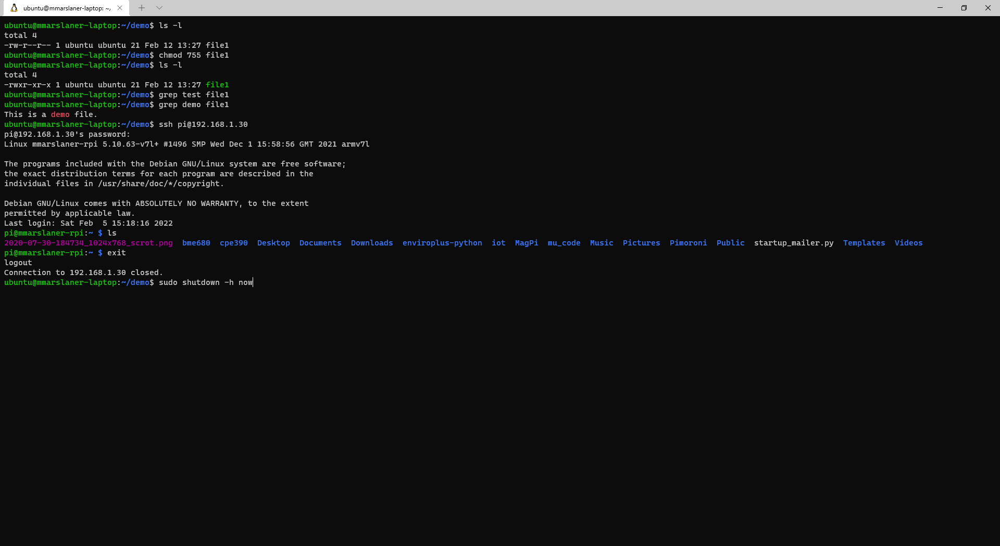

# Labs 1 and 2 — Command Line
I pledge my honor that I have abided by the Stevens Honor System.  
  
For Labs 1 and 2, I demonstrated performing various commands on the command-line interface.
I used Windows Terminal and Windows Subsystem for Linux on my school laptop to complete the lab.

## Assignment
  
  
  
  
  
  
  
I purposely did not enter the `clear` command.
In the later screenshots,  you can see the effects of the command and how it cleared the terminal screen though.  
  
  
  
  
  
 
I purposely did not enter the `sudo shutdown -h now` command for obvious reasons
