# Lab 10 - Blockchain
I pledge my honor that I have abided by the Stevens Honor System.  
  
For Lab 10, I demonstrated running blockchain servers and mining blocks from them.
I used Windows Terminal and Windows Subsystem for Linux on my school laptop to complete the lab.
## Assignment
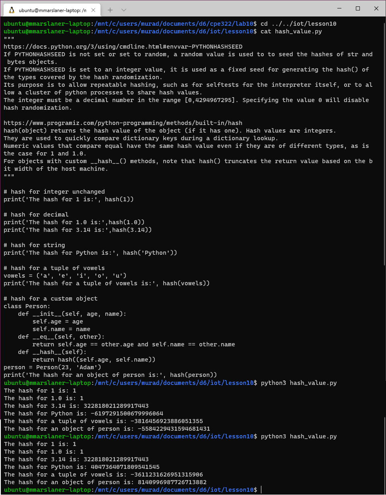  
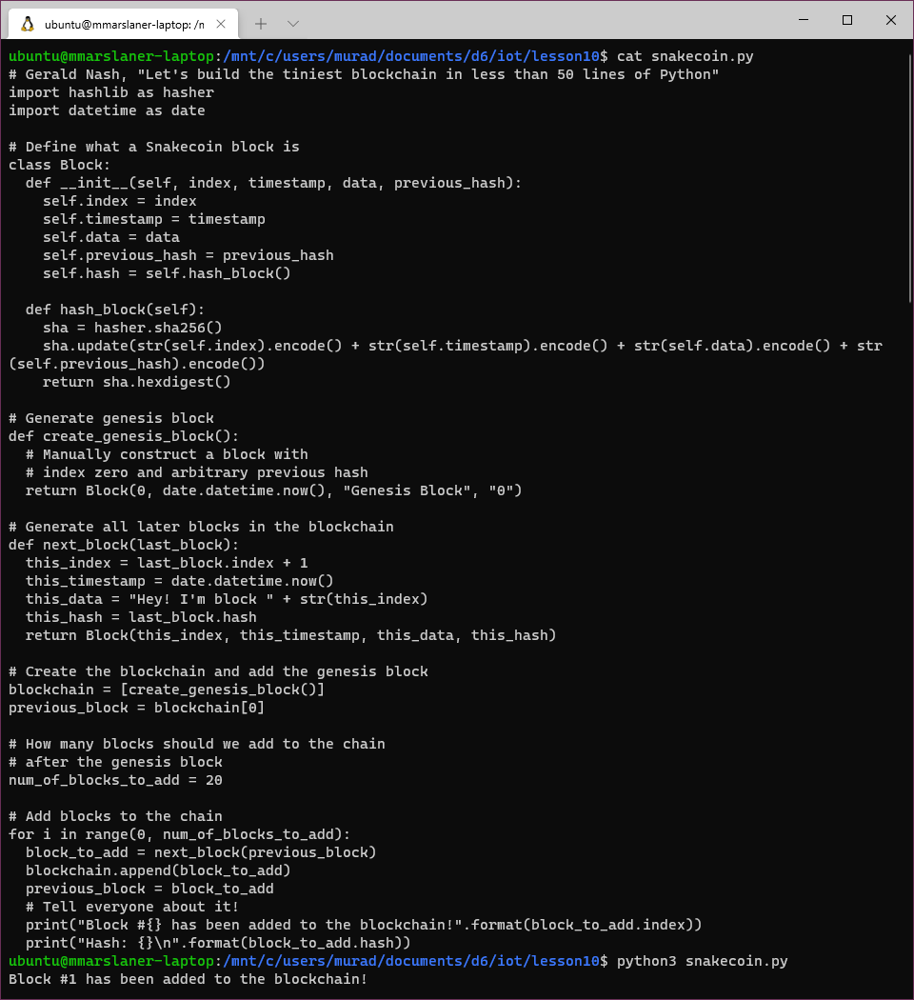  
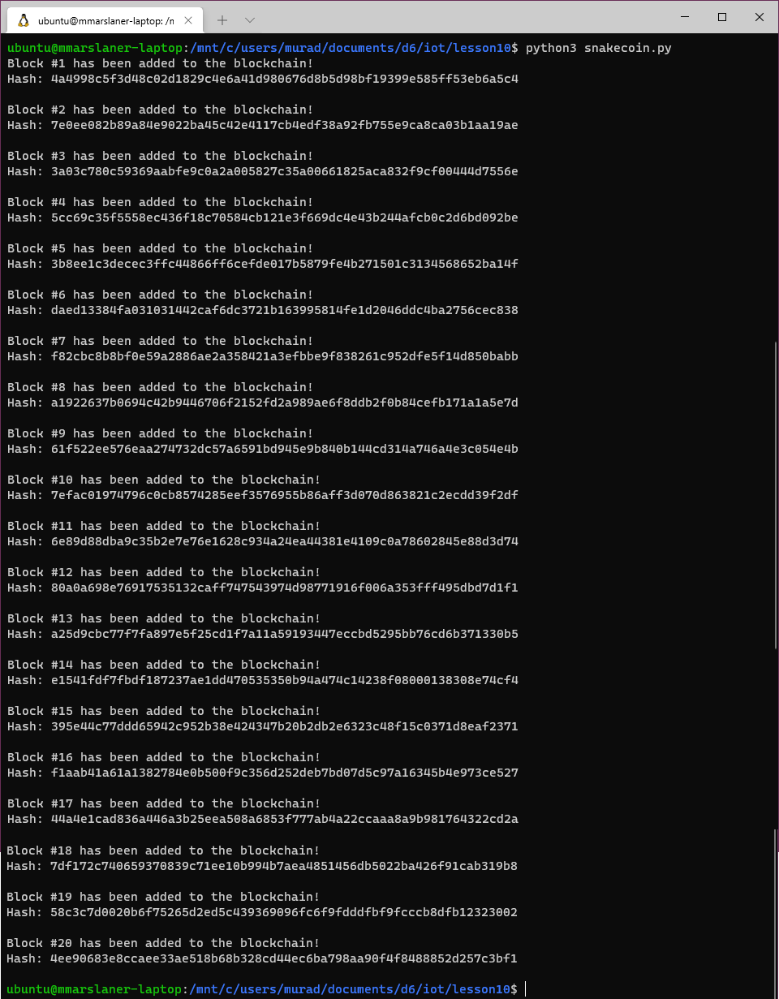  
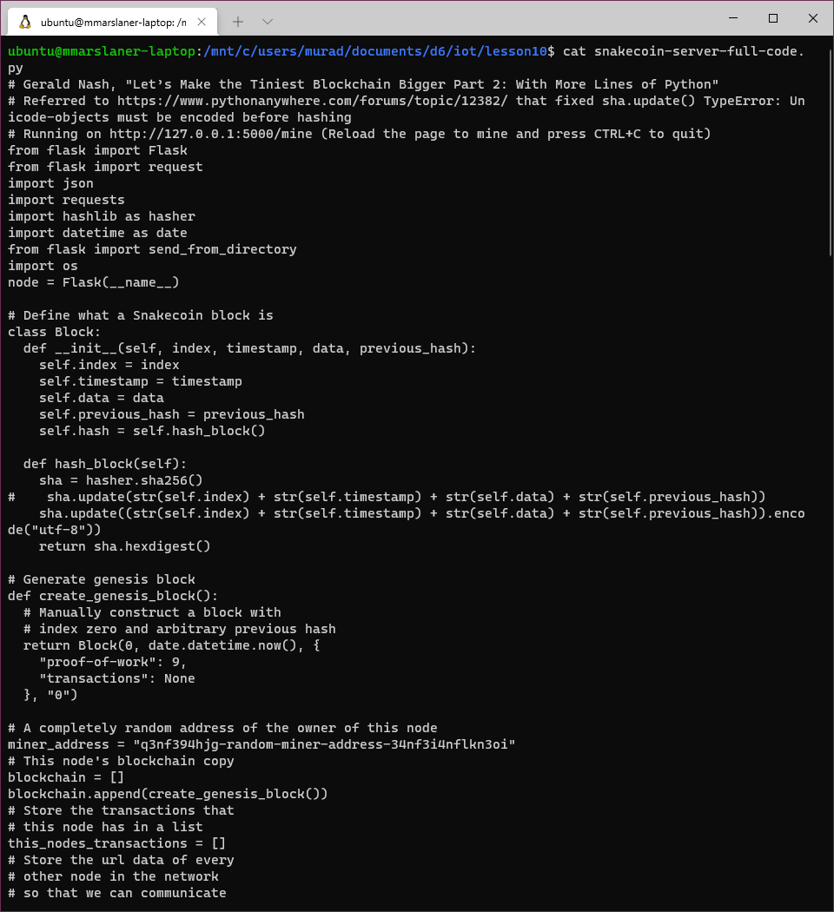  
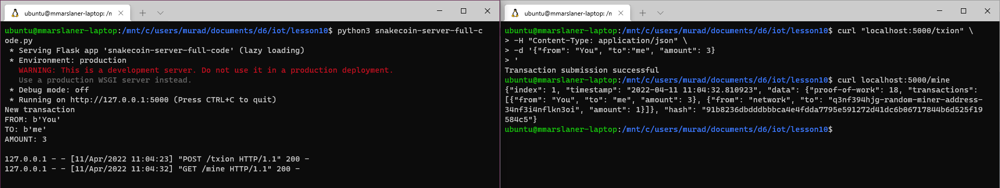  
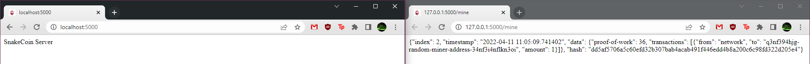  
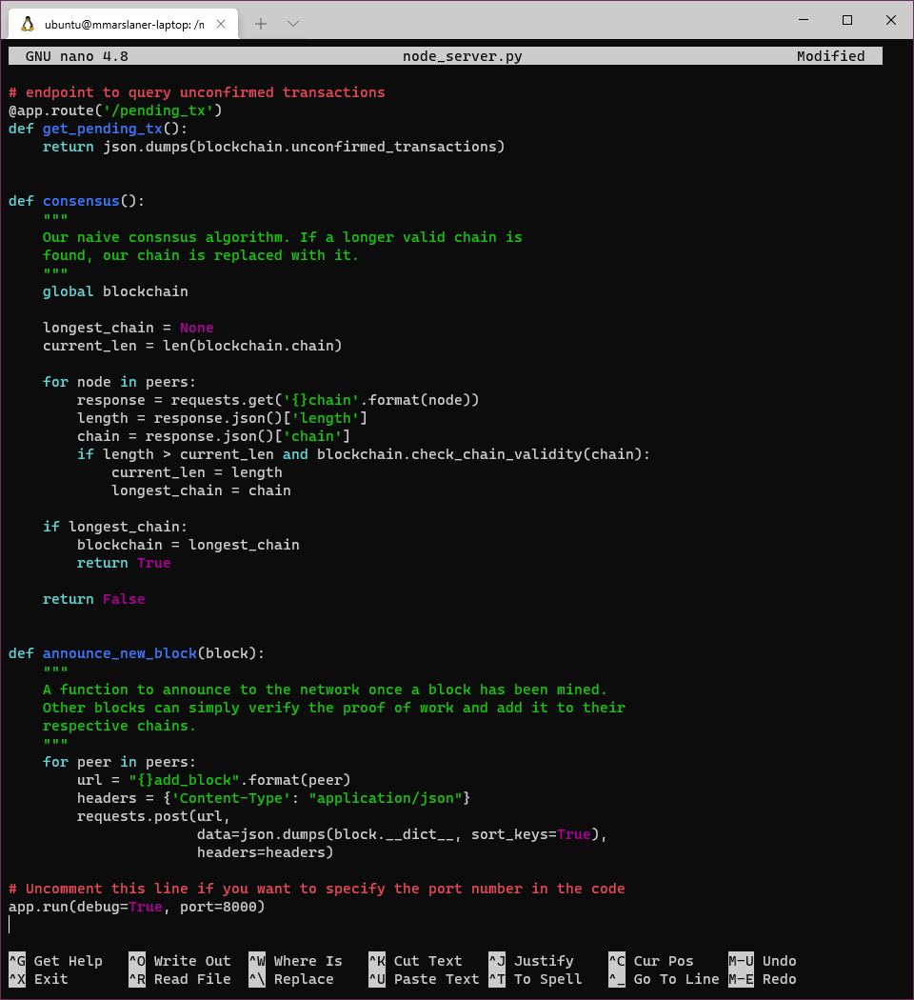  
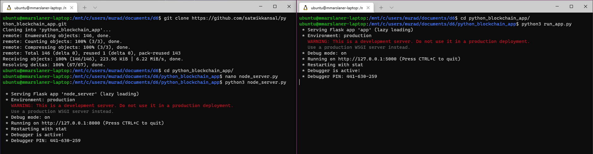  
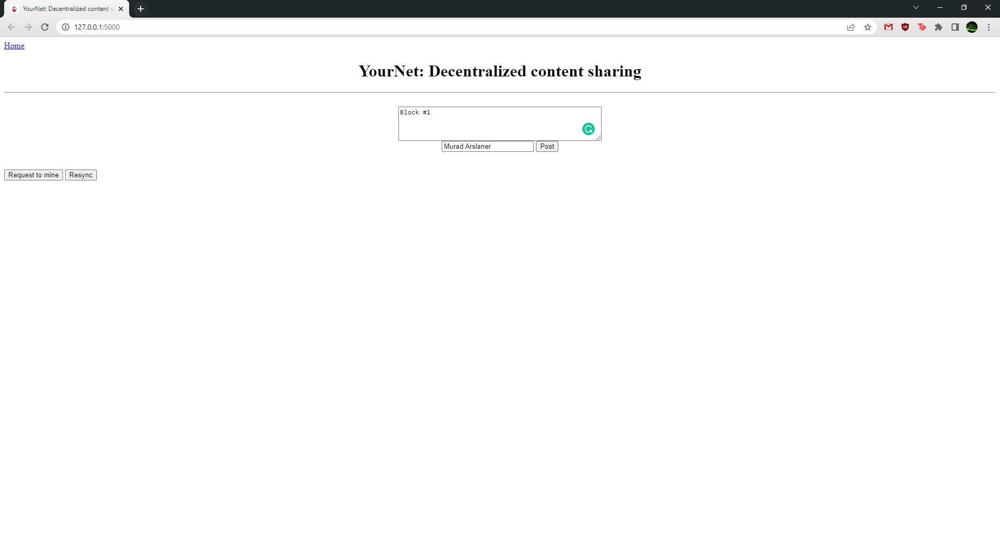  
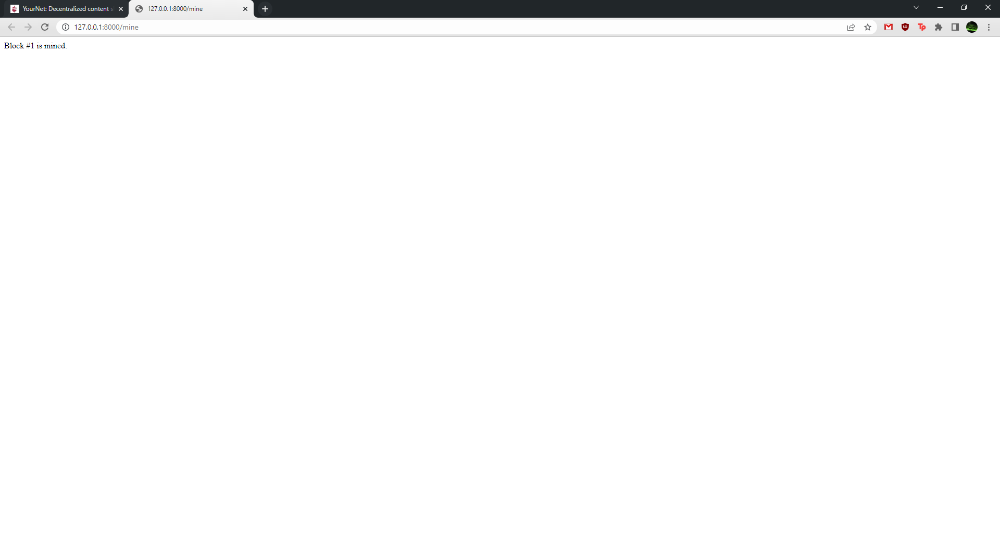  
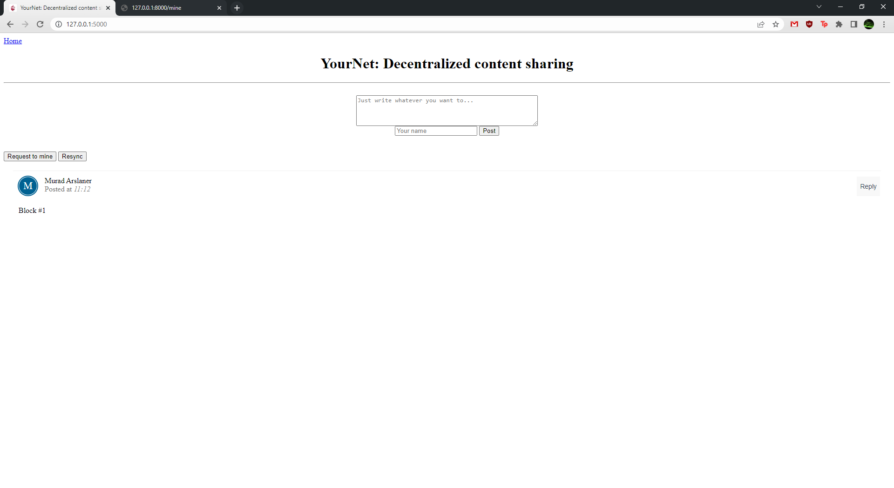  
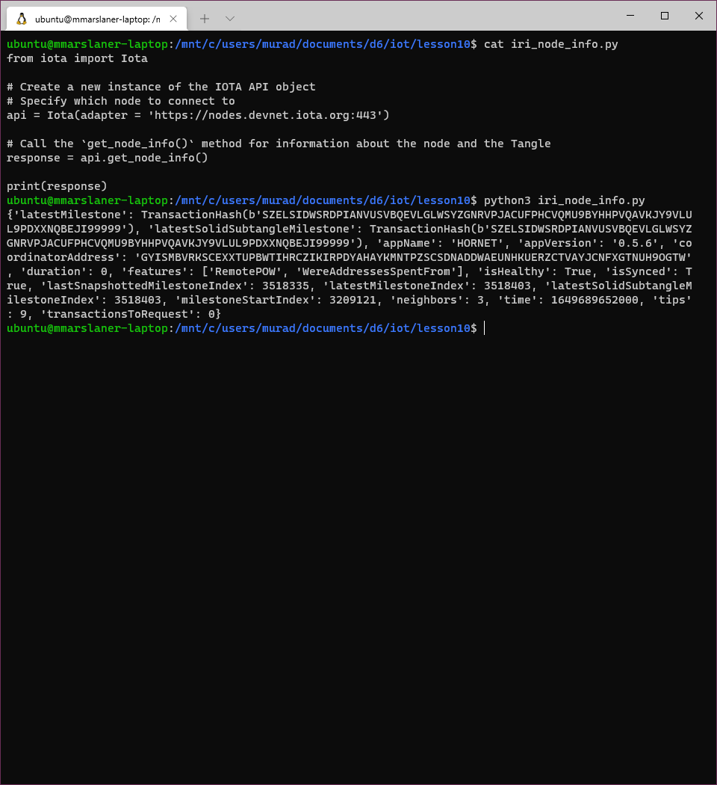
