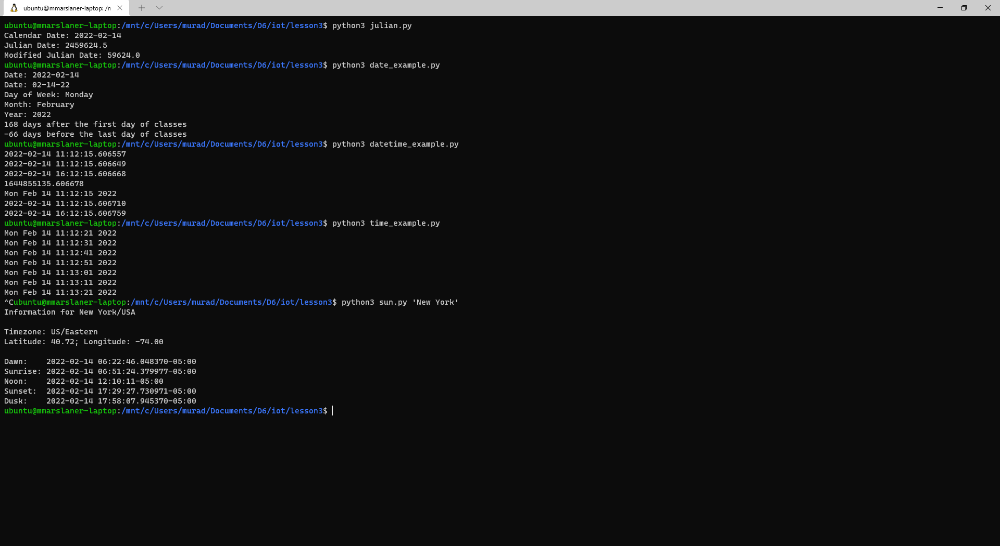
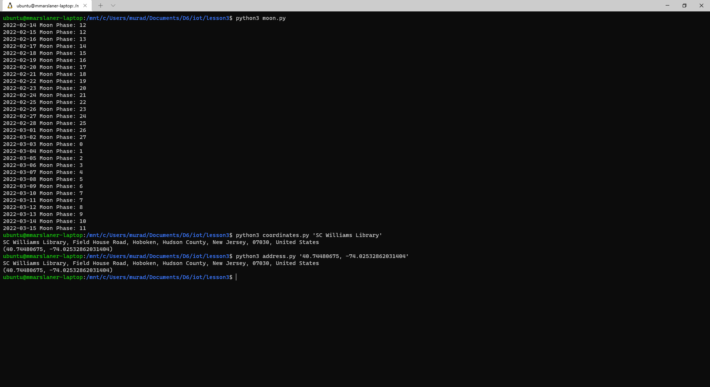
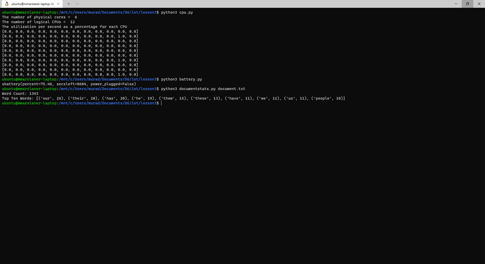
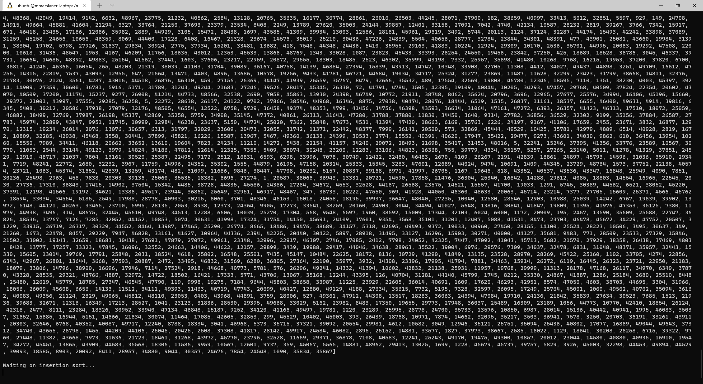
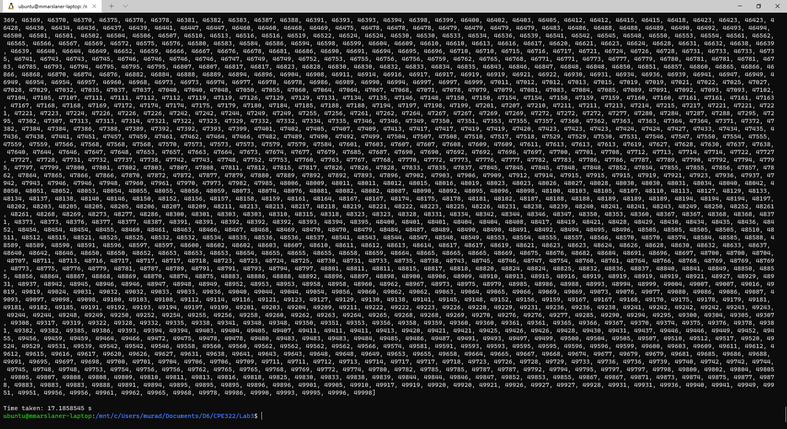

# Lab 3 — Python
I pledge my honor that I have abided by the Stevens Honor System.  
  
For Lab 3, I demonstrated running various Python scripts (including one I wrote)
I used Windows Terminal and Windows Subsystem for Linux on my school laptop to complete the lab.

## Assignment
  
  
  
  
  
  
  
  
Here's a program I wrote based on a (not very good) sorting algorithm I learned about in another class:  
  
  
  
Insertion sort takes a long time for large arrays, making O(n^2) comparisons and swaps on average
