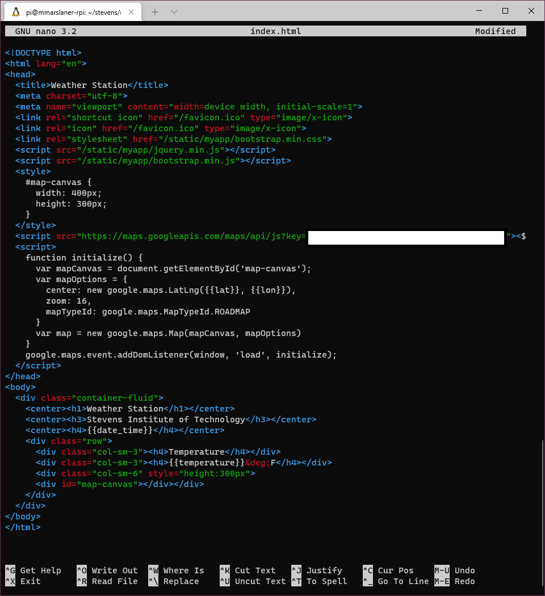
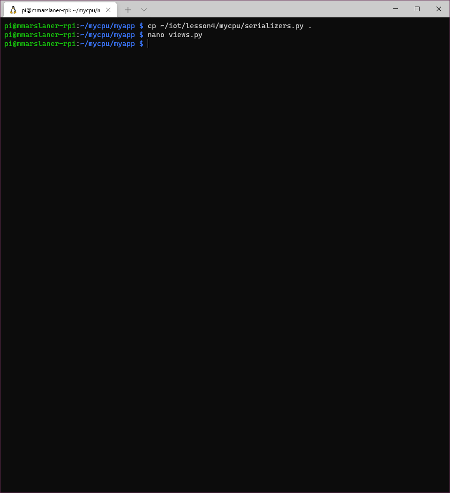
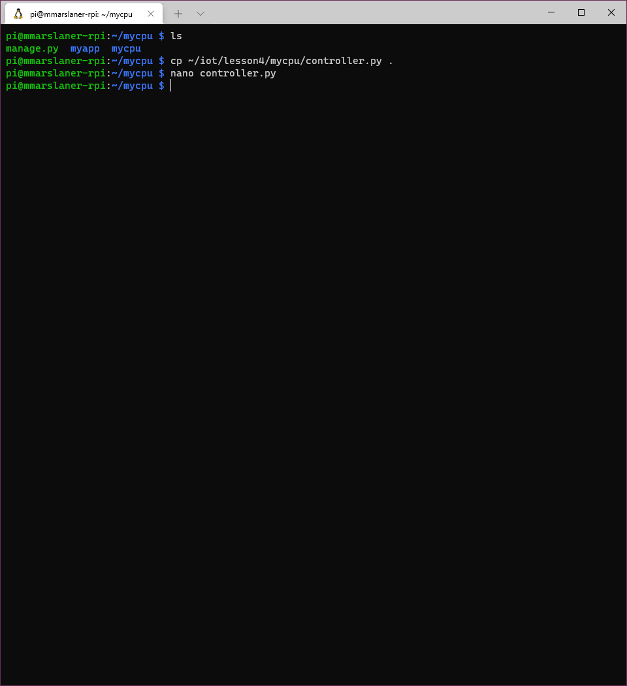

# Labs 4 - Django and Flask
I pledge my honor that I have abided by the Stevens Honor System.  
  
For Lab 4, I demonstrated running servers and viewing apps through Django, Django REST, and Flask.  
I used my Raspberry Pi through Windows Terminal SSH and VNC Viewer on my school laptop to complete the lab.  
  
I omitted showing steps of the installation process for Django and Django REST since showing the servers and apps running would prove that I successfully installed the frameworks.
## Django: stevens
### Start a Django project and app

### Create MySQL database

### Edit settings.py
  

### Copy Python and HTML files

### Enable and add Google Maps API key

### Copy static files

### Create superuser and run Django server

### Add temperature data

### View app through VNC Viewer

### View app through laptop browser

## Django REST: mycpu
I omitted showing some of the setup steps for the sake of brevity since a few of the steps were identical to the Django setup shown above.
### Start a Django project and app
Omitted due to redundancy
### Edit settings.py

### Copy Python and HTML files
Omitted due to redundancy
### Change default password
  

### Add Google Maps API key and copy static files
Omitted due to redundancy
### Copy and change default password in controller.py
  

### Install psutil
I had psutil installed already.
### Create superuser
Omitted due to redundancy.
### Add location data

### Post data to Dt List, Cpu List, and Mem List
  
  

### Run native controller service in separate terminal window

### Run Django server and view app through laptop browser

## Flask: hello_world
### Run Flask server  
  
### View app through VNC Viewer
  
