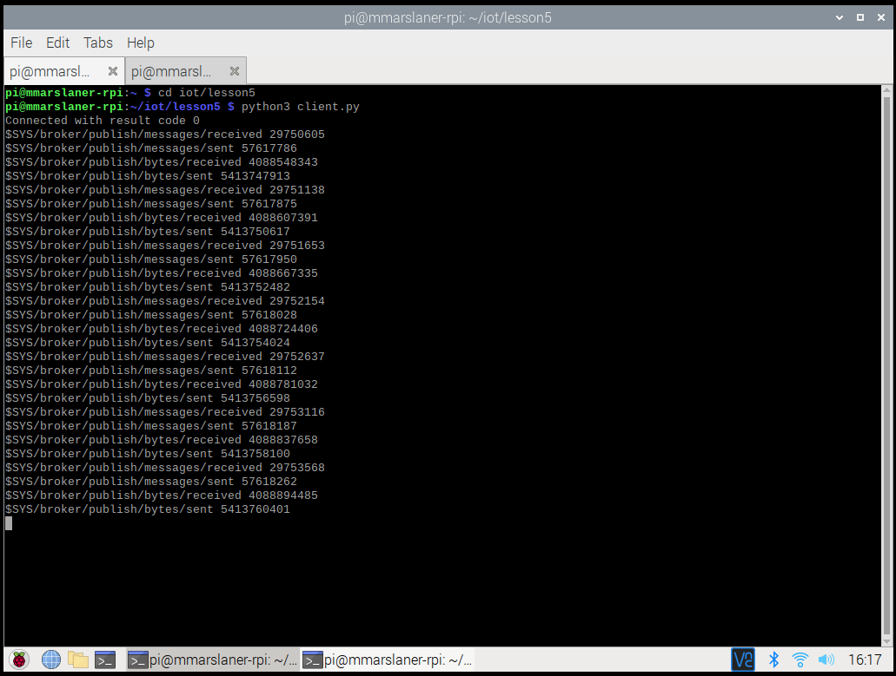

# Lab 5 - Paho-MQTT
I pledge my honor that I have abided by the Stevens Honor System.  
  
For Lab 5, I demonstrated subscribing to a message service and publishing messages using Mosquitto and Paho.  
I used my Raspberry Pi through VNC Viewer on my school laptop to complete the lab.  
## Mosquitto
I omitted showing the steps of the installation process for Mosquitto since the publish-subscribe system running would prove that I successfully installed the MQTT implementation correctly.  
  
  
  
## Paho
  
  
  
  
  
  
  
