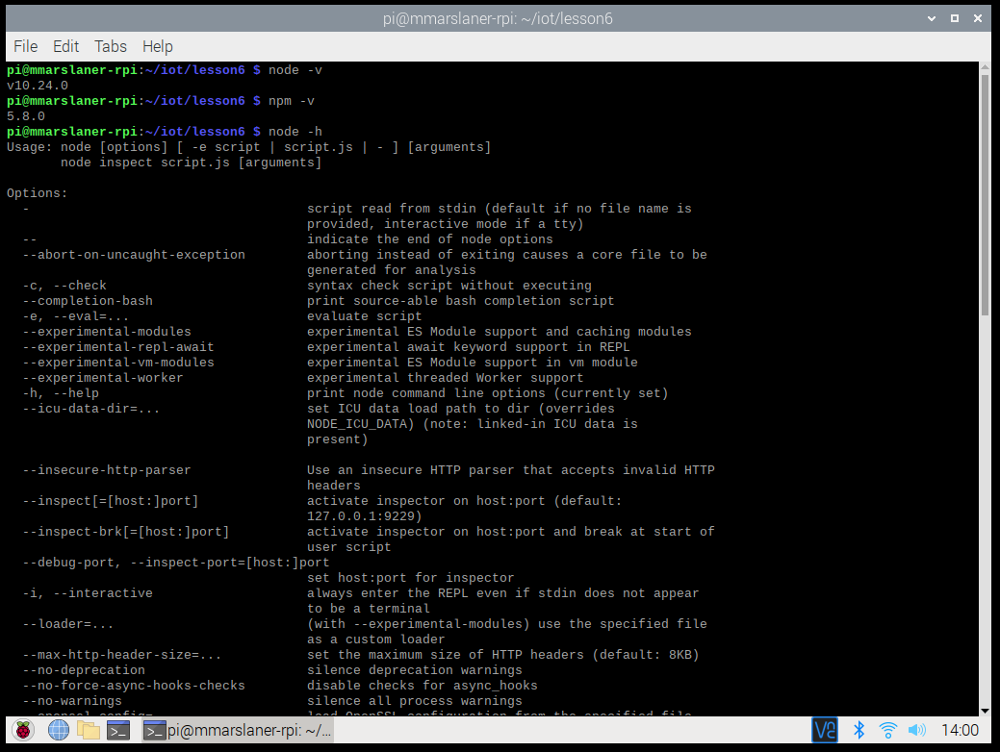
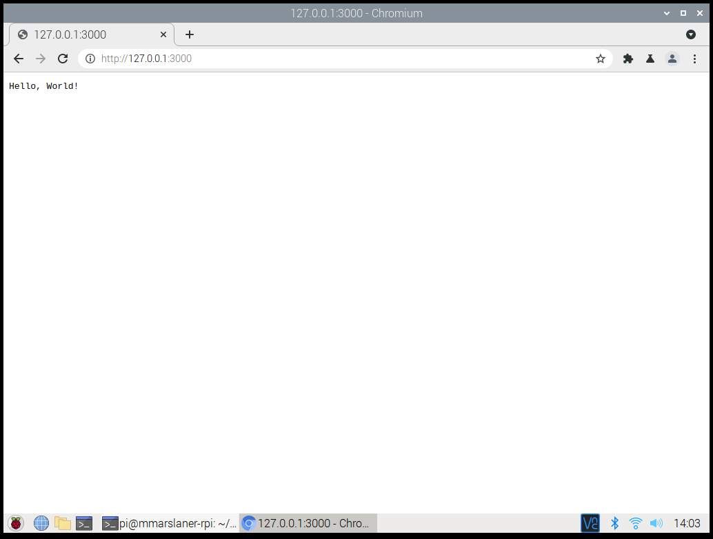
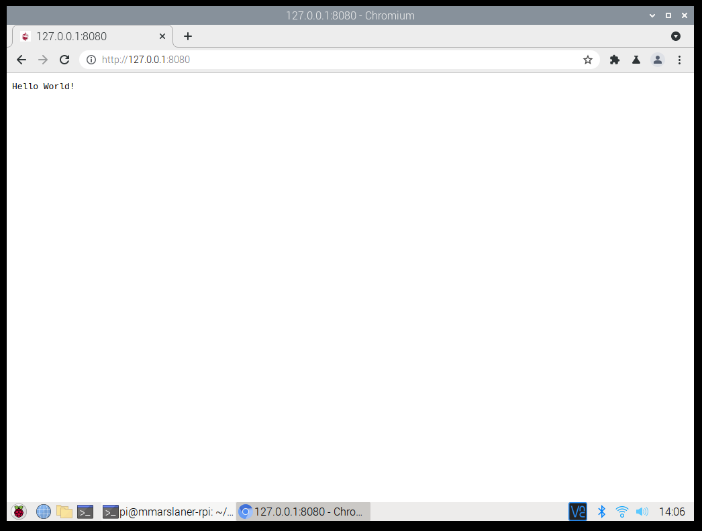
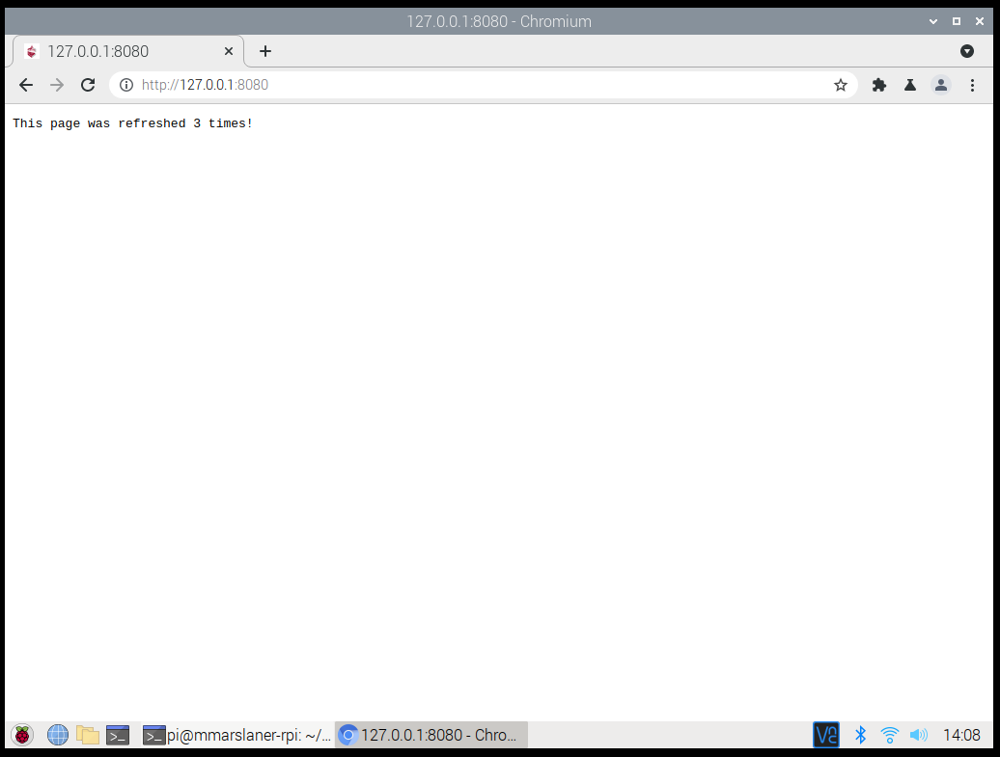
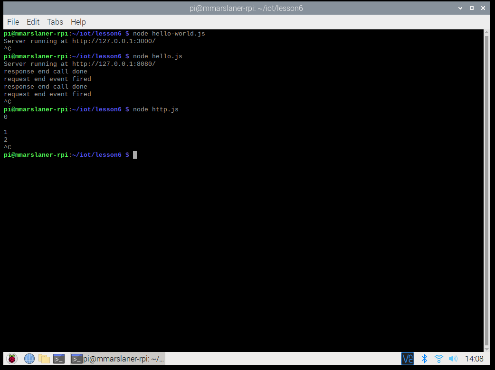
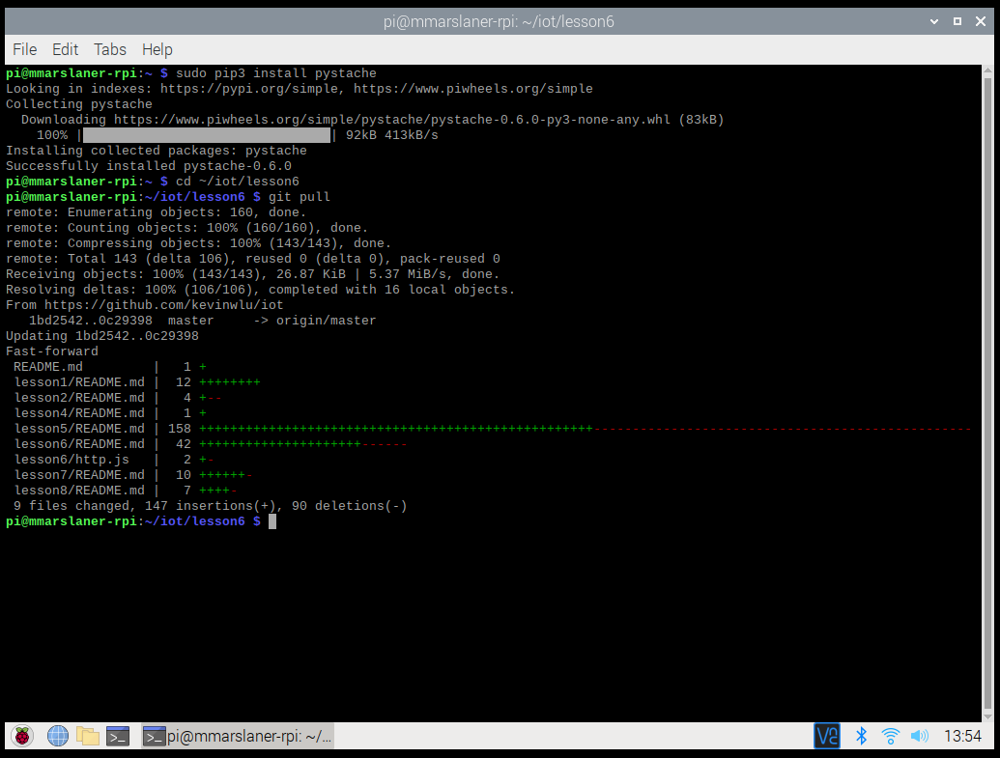
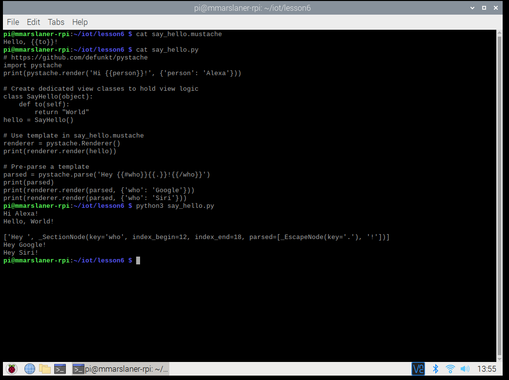

# Lab 6 - Node.js and Pystache
I pledge my honor that I have abided by the Stevens Honor System.  
  
For Lab 6, I demonstrated using Node.js and Pystache to run code in the terminal and web browser.
I used my Raspberry Pi through VNC Viewer on my school laptop to complete the lab.  
## Node.js
  
  
  
  
  
## Pystache
  

