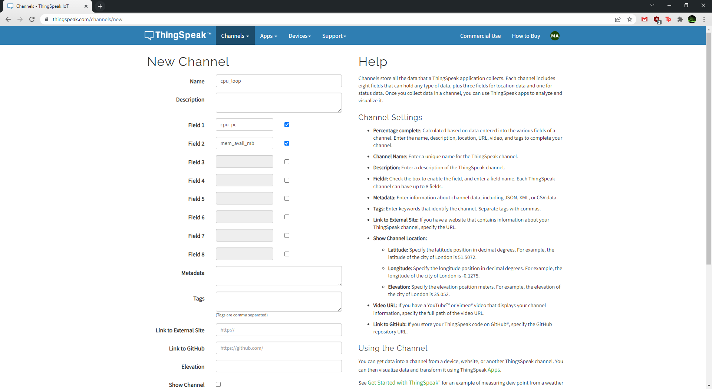
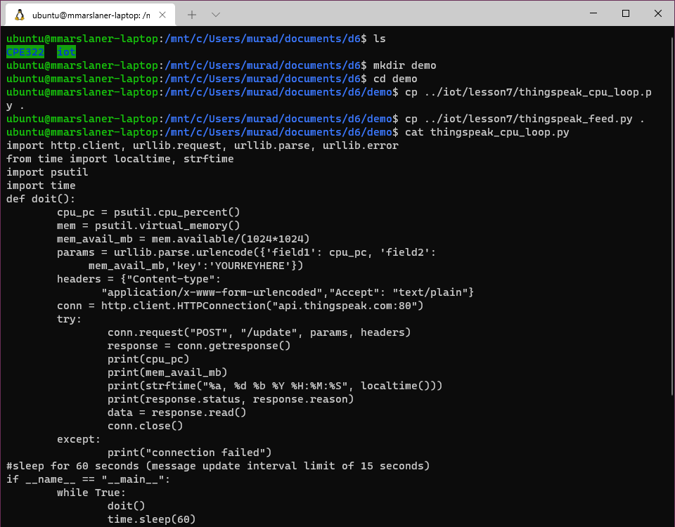
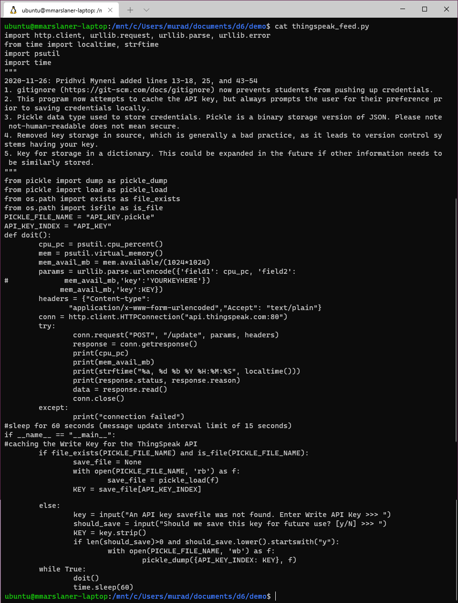
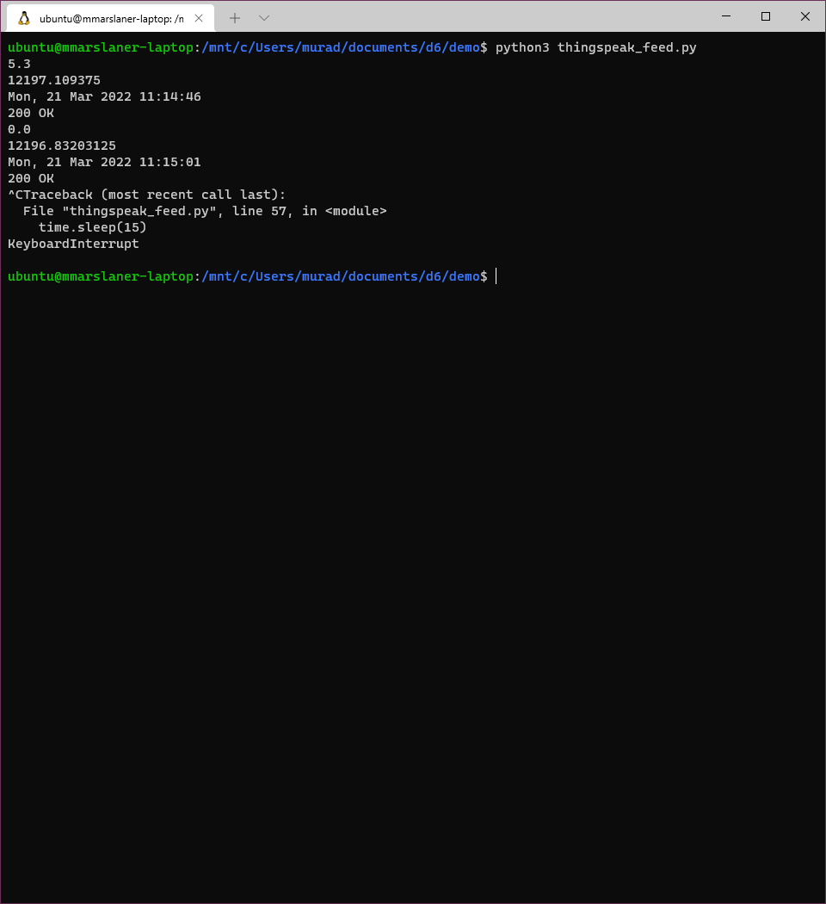
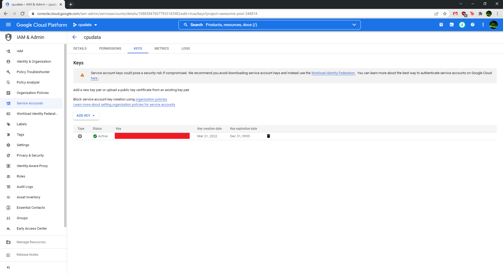
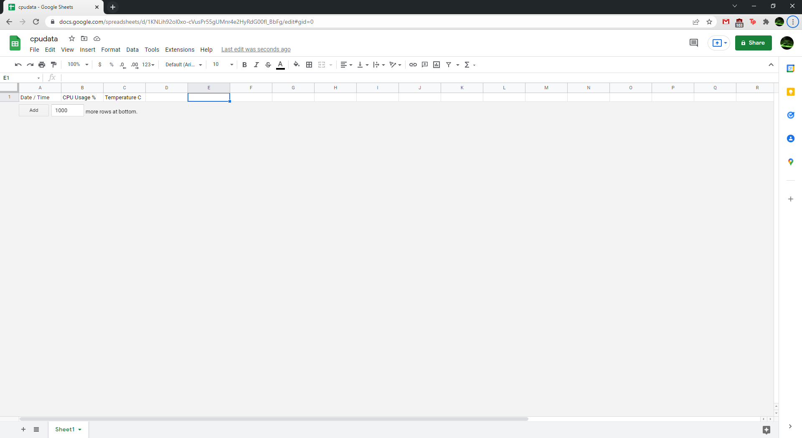
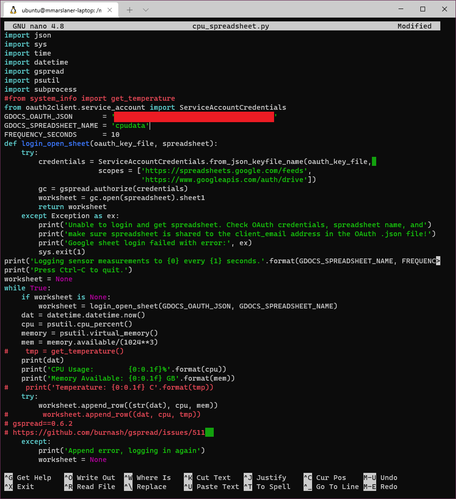
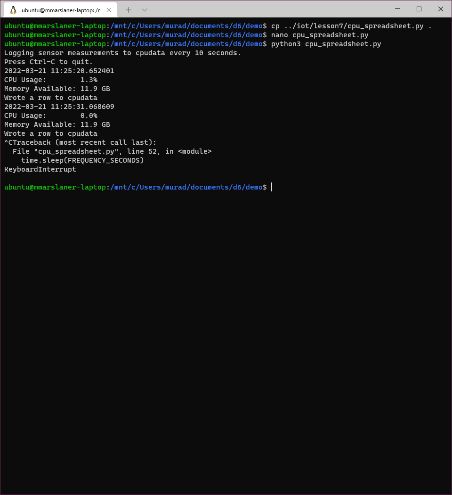
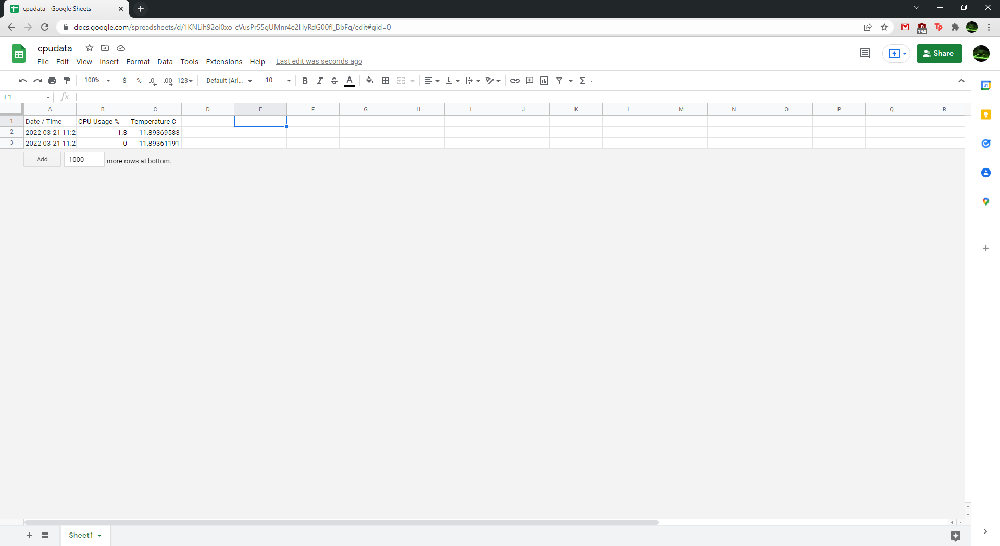

# Lab 7 — ThingSpeak and Google Sheets
I pledge my honor that I have abided by the Stevens Honor System.  
  
For Lab 7, I demonstrated using ThingSpeak and Google Sheets to push computer system information to cloud platforms.
I used Windows Terminal and Windows Subsystem for Linux on my school laptop to complete the lab.
## ThingSpeak

## Google Sheets

