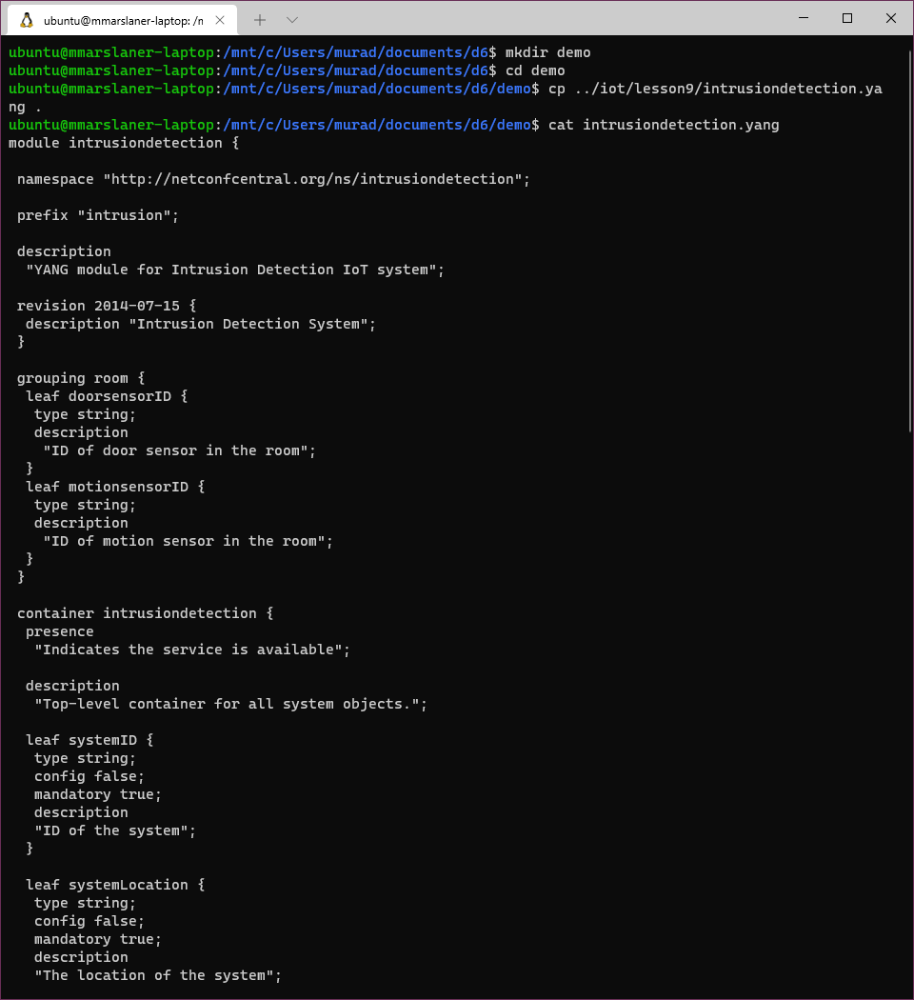
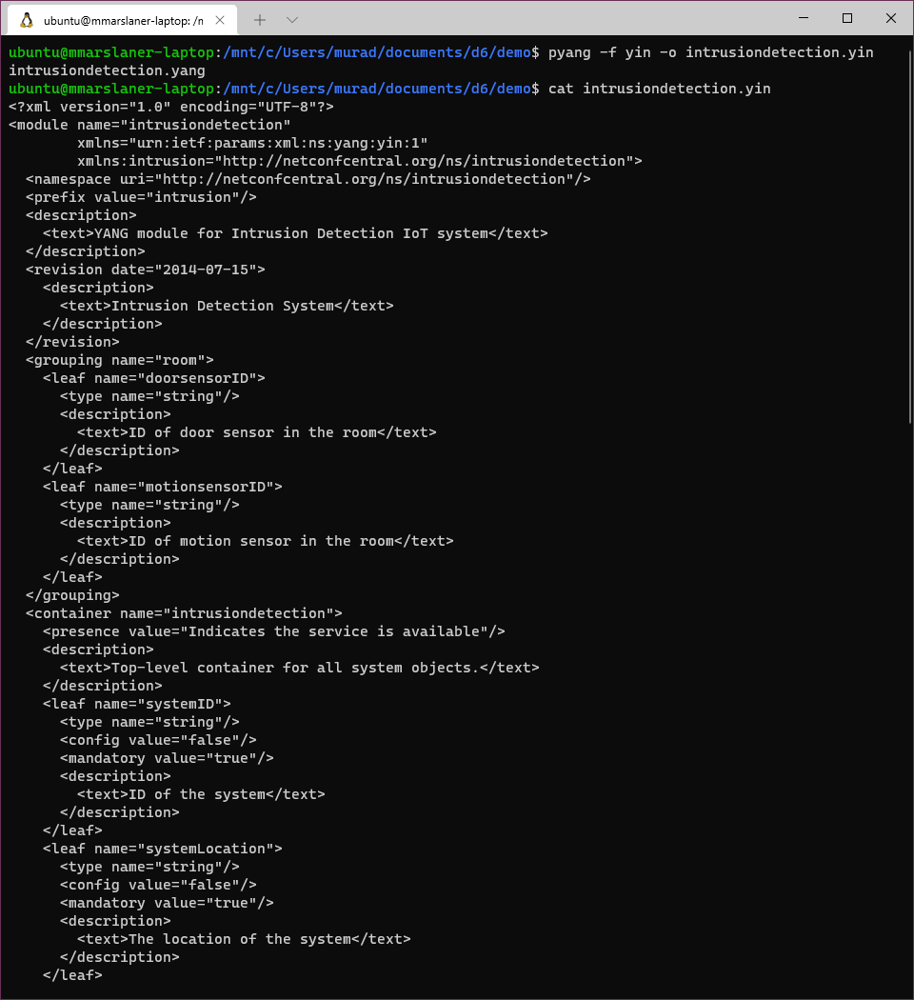
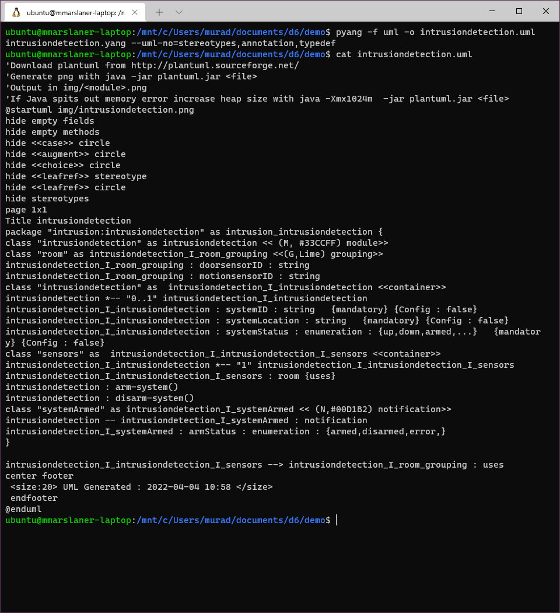
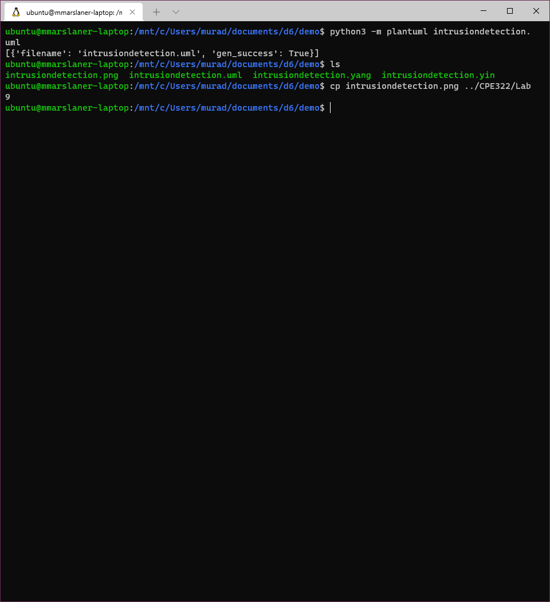
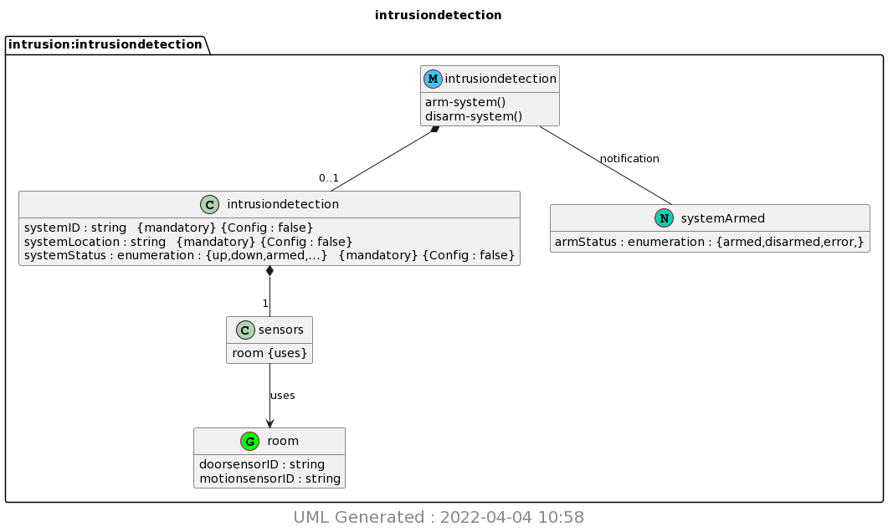

# Lab 9 - YANG
I pledge my honor that I have abided by the Stevens Honor System.  
  
For Lab 9, I demonstrated using YANG and PlantUML to generate a chart.
I used Windows Terminal and Windows Subsystem for Linux on my school laptop to complete the lab.
## Assignment

